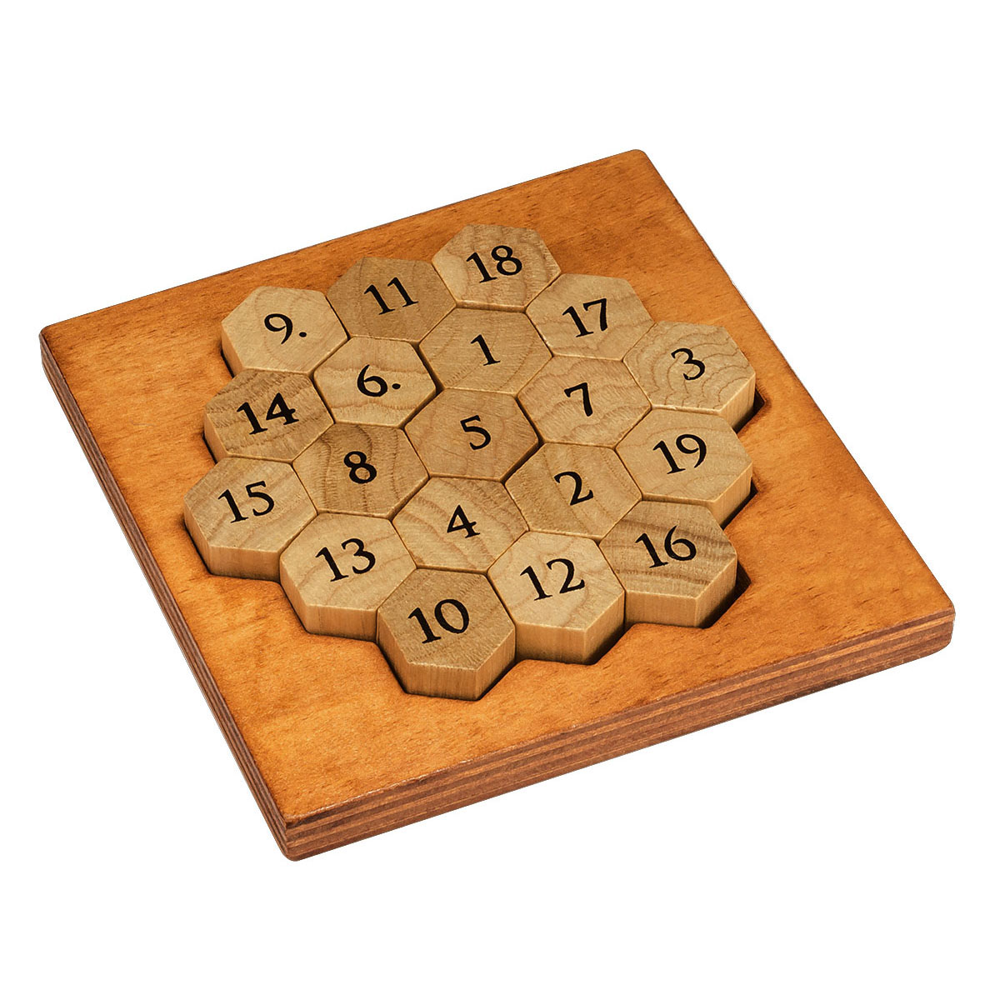
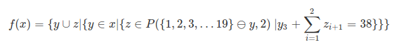
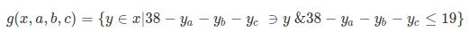
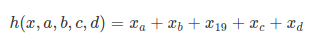
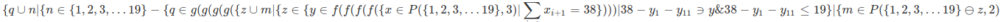
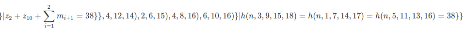

# Magic Hexagon

> **Description**
> Each row (not just horizontal, but also diagonal) add up to 38? There are 15 rows in all directions to complete, each made up of 3, 4 or 5 pieces. This brilliant concept allows you to complete the puzzle by using every number from 1 – 19. *([professorpuzzle.com](https://www.professorpuzzle.com/products/aristotles-number-puzzle/))*

There are **121,645,100,408,832,000** permutations for this puzzle. Certainly not something you want to brute force. 

## The Challenge
Write a program that doesn't take a month of 24/7 calculating to find all the possible answers.

## The Method
Using permutations and process of elimination, the program starts from the outer ring and works its way to the center in a spiral fashion.

If you go by the image above, it calculates the pieces in the following order:

1. Tiles 9, 11, & 18
2. Tiles 17 & 3
3. Tiles 19 & 16
4. Tiles 12 & 10
5. Tiles 13 & 15
6. Tile 14
7. Tiles 8 & 6
8. Tile 1
9. Tile 7
10. Tile 2
11. Tile 4
12. Tile 5

## Equations
### Functions
1. 
2. 
3. 

### Main Equation

## The Result
On my laptop, I'm able to get 12 solutions in  ~13s +/- 1s.
I won't post the answers here, but if you really want to know the answers, you can obviously just run the program using <code>python main.py</code>

## FAQ

**How do I run this?**
Run main.py from your command line using <code>python main.py</code>

**Why did you do this?**
Someone gave me this puzzle as a present, and I thought it was an interesting challenge.

**Why didn't you use Cython/Numba/pypy?**
- **Cython:** Too lazy to learn the syntax
- **Numba:** nopython mode does not like arrays larger than 1 dimmension. Not worth the hassle to figure out how to do everything using only 1 dimmensional arrays.
- **pypy:** My benchmarks were better in vanilla python.

**Why didn't you use C/C++/Java?**
- numpy compiles to C
- numpy allows you to do static typing
- I'd rather use Python than shave off a second or two with a non-interpretive language. Python's just a really productive language, ok?

**What is brute.py?**
Desperation.

**Super slow Python can't calculate 121 quadrillion permutations in less than 15 seconds!?! On a laptop?!?!! \*foaming from mouth\***
Ok.

## Some peformance tips for Python users:
- Most numpy functions compile to C. 
- You can do static typing with numpy.
- Loops kill your performance. Use list comprehensions instead. 
- Use iterators and generators.
- Use an efficient algorithim. If one doesn't exist, create one.
