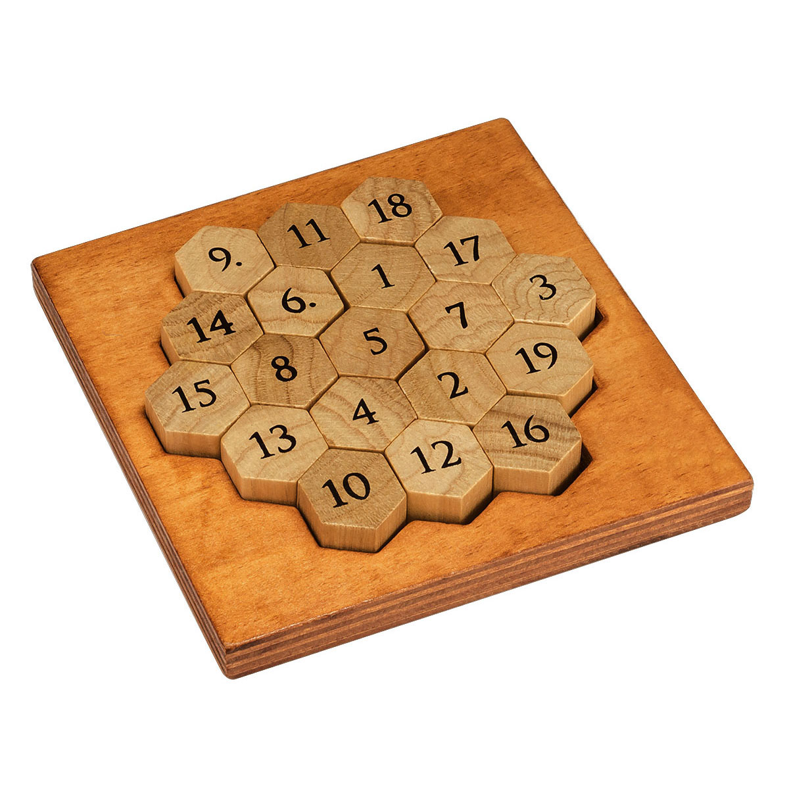

# What is Aristotle's Number Puzzle?
Each row (not just horizontal, but also diagonal) add up to 38? There are 15 rows in all directions to complete, each made up of 3, 4 or 5 pieces. This brilliant concept allows you to complete the puzzle by using every number from 1 – 19.
*Description is from [professorpuzzle](https://www.professorpuzzle.com/products/aristotles-number-puzzle/)*

# How does this program work?
## Step 1: Generating a usable table for mathematical operations
To solve this puzzle programmatically, the puzzle needs to be formatted in a way that Python can operate computations on it.

*What the puzzle looks like.*

To do this, a table from (0,0) to (8,4) is generated to house all 19 pieces, using variables a - s. This is done in pieces.py

## Step 2:
